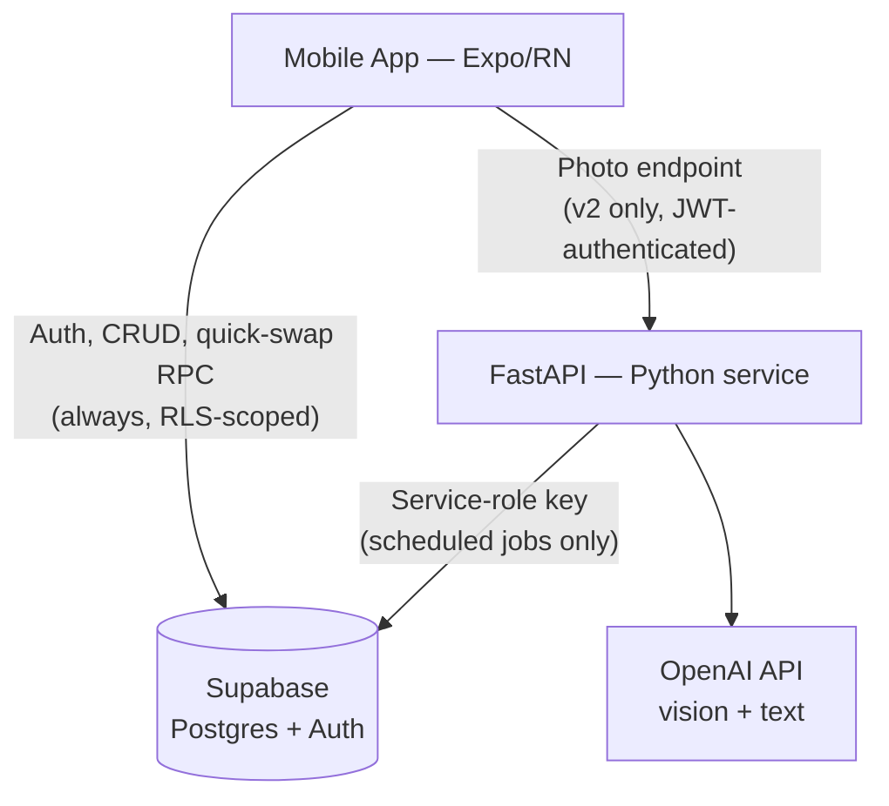

# Meal Planner — Technical Architecture & Decisions (v1)

Companion document to `version1_mealPlanner_functionalities.md`. Scope: Tamil Nadu family use, single timezone (IST), scaling to multi-user without a schema rework.

---

## 1. Finalized tech stack

| Layer | Choice | Notes |
|---|---|---|
| Mobile client | React Native via **Expo**, cross-platform | Managed push notifications (APNs + FCM behind one API) |
| Database | **Postgres**, hosted on Supabase | Relational — matches the join-heavy access patterns (grocery aggregation, history, combo validation) |
| Auth | **Supabase Auth** + Row Level Security | Wired from day 1, even for family-only use — makes "add a user" a signup, not a migration |
| Backend compute | **Python**, packaged as a **FastAPI** app | v1 needs no live HTTP surface for most flows — see §3 |
| Scheduling / hosting | **Render** (Cron Jobs + Background Worker service types) | Chosen over Railway for cron reliability — see decision log |
| LLM | **OpenAI API**, Python SDK, **Pydantic** for structured-output validation | Cost-tier model (nano/mini class); see §5 for prompt structure |
| Push delivery | **Expo Push Service** | Wraps APNs + FCM, single integration |
| Storage / CDN (future) | Supabase Storage | For dish images if/when added — CDN is automatic, not built |
| Distributed cache | **None** | See decision log — OpenAI's automatic prompt caching covers the one real caching win |
| Vector DB / NoSQL / Graph DB | **None** | Single Postgres instance — see decision log |

---

## 2. Architecture flows

### 2.1 Weekly generation (daily sweep, trigger direction depends on `planning_mode`)

```mermaid
flowchart TD
    A[Render Cron — daily, 8 PM IST] --> B{"Reserves: grocery_day was yesterday?<br/>Suggestion: grocery_day is tomorrow?"}
    B --> C{generation_jobs row<br/>already 'done' for<br/>this user + week?}
    C -->|yes| Z[Skip — already generated]
    C -->|no| D[Python job: weekly_generate.py]
    D --> E[(Postgres / Supabase)<br/>catalog, ingredients,<br/>10-day history, availability]
    E --> D
    D --> F[OpenAI API<br/>structured weekly menu JSON]
    F --> D
    D --> G{"Validate: candidates, combo<br/>template, in-week duplicates,<br/>quota, dietary restrictions"}
    G -->|pass| H[(Postgres) write meal_plans<br/>+ plan_items, mark job 'done']
    G -->|fail after 1 retry| I[Fallback: rule-based<br/>selection — see §5.1]
    I --> H
    H --> J["Your week is ready" push —<br/>only fires after successful write]
```

Reserves mode generates the day *after* `grocery_day` (offset: today = `grocery_day + 1`), so the plan reflects what's already on hand. Suggestion mode generates the day *before* `grocery_day` (offset: today = `grocery_day − 1`), on the same fixed 8 PM sweep — not a second cron — so the list is ready overnight for that morning's shop. Generating "on" `grocery_day` itself doesn't work: by 8 PM that day's shopping is already done, and the list would arrive too late to be useful, which defeats the entire point of this mode. `available_ingredients` (§4) is only queried/applied in Reserves mode; Suggestion mode skips ingredient filtering entirely, so the candidate set for that call is the full slot-filtered catalog with no availability narrowing.

Idempotency is application-level, via the `generation_jobs` status check — not a provider-native mechanism. I couldn't confirm OpenAI's generation endpoints support a native `Idempotency-Key` header (only their separate Commerce/Checkout API confirms this); the app-level check doesn't depend on that being true either way.

Same daily-sweep shape as the notification job below — this is a reused pattern, not new scheduling complexity. First-time signup with "start today" selected triggers an immediate one-off run outside this sweep, for the remaining days of the current week only.

### 2.2 Daily reminder (fires daily — 8 PM IST)

```mermaid
flowchart TD
    A[Render Cron — 8 PM IST daily] --> B[Python job: daily_notify.py]
    B --> C[(Postgres) read tomorrow's plan,<br/>write notification_log: pending]
    C --> D[Expo Push: send,<br/>store ticket id]
    D --> E{Send accepted?}
    E -->|yes| F[notification_log: sent]
    E -->|no| G[Retry once, same evening]
    G --> D
    F --> H[Follow-up job ~30 min later:<br/>reconcile Expo receipts]
    H --> I[notification_log:<br/>delivered / failed]
```

This is the scoped-up version of what was previously deferred as "outbox pattern, full alerting." The distinction that matters: this notification *is* the product — a silent miss is invisible by design, since the entire point is the user doesn't have to check. That's a different risk profile than the other reliability items still correctly deferred below. What's in v1: the ticket, the receipt reconciliation step, one same-day retry. What's still out: automated alerting/dashboards on top of `notification_log` — see §8.

### 2.3 Client traffic split



Not diagrammed because it needs no orchestration: the mobile app's plain reads (viewing plans, grocery list) go directly to Supabase under RLS — no backend hop.

---

## 3. What actually needs a live HTTP endpoint

Deliberately minimal — most interactions are plain CRUD against Supabase, not Python:

| Interaction | Path |
|---|---|
| View plan, grocery list | Direct Supabase read (RLS-scoped) |
| Manual ingredient checklist | Direct Supabase write |
| Quick single-slot swap | Postgres RPC / stored function — no LLM call, no Python hop |
| Weekly generation | Python job, cron-triggered, no HTTP surface |
| Daily notification | Python job, cron-triggered, no HTTP surface |
| Grocery-photo identification (v2) | **The only planned live FastAPI endpoint** — needs OpenAI vision |

**Auth boundary for that endpoint, spelled out rather than left implicit:** FastAPI verifies the Supabase JWT via a dependency and extracts `user_id` from the token's `sub` claim. It never takes `user_id` from the request body. This is the one live surface where a multi-tenant leak could happen if skipped — worth being explicit before it's built, not after.

---

## 4. Data model (Postgres)

```sql
-- Dish catalog
create table dishes (
  id uuid primary key default gen_random_uuid(),
  name text not null,
  item_type text not null,        -- tiffin | rice | gravy | poriyal | kootu | curd | snack | sweet
  veg_or_nonveg text not null,    -- veg | nonveg
  region_style text,
  prep_minutes int,
  track_variety boolean not null default true,  -- false for rice, curd — exempt from 10-day rule
  dietary_flags text[] default '{}'  -- e.g. {dairy, gluten, nuts} — enforced downstream, see §5.1 note
);

-- Ingredients
create table ingredients (
  id uuid primary key default gen_random_uuid(),
  canonical_name text not null unique,
  is_staple boolean not null default false  -- true = excluded from grocery-photo matching
);

create table ingredient_aliases (
  alias_text text primary key,
  ingredient_id uuid references ingredients(id)
);

create table dish_ingredients (
  dish_id uuid references dishes(id),
  ingredient_id uuid references ingredients(id),
  primary key (dish_id, ingredient_id)
);

-- User context
create table user_profiles (
  id uuid primary key references auth.users(id),
  nonveg_days_per_week int,
  nonveg_day_pattern text[],       -- e.g. {wed, sat}
  dietary_restrictions text[],
  dinner_style text default 'rice',-- 'rice' | 'tiffin' — onboarding question
  planning_mode text not null default 'suggestion', -- 'reserves' | 'suggestion' — determines generation trigger direction, see §2.1
  grocery_day text not null,       -- day of week; trigger offset from this depends on planning_mode
  timezone text not null default 'Asia/Kolkata'  -- IANA string; cheap to store now, cron stays fixed-IST for v1 — see decision log
);

create table user_favorite_dishes (
  user_id uuid references user_profiles(id),
  dish_id uuid references dishes(id),
  primary key (user_id, dish_id)   -- exempt from the 10-day rule ONLY, per-user; still subject to in-week duplication; capped ~5-8/user at the app layer or variety degrades
);

-- Generated plans
create table meal_plans (
  id uuid primary key default gen_random_uuid(),
  user_id uuid references user_profiles(id),
  plan_date date not null,
  slot text not null,              -- morning | afternoon | night | snack_1 | snack_2 | snack_3
  created_at timestamptz default now(),
  unique (user_id, plan_date, slot)
);

create table plan_items (
  id uuid primary key default gen_random_uuid(),
  plan_id uuid references meal_plans(id),
  item_type text not null,
  dish_id uuid references dishes(id),
  make_extra boolean default false  -- batch-cook / intentional repeat flag
);

-- Weekly ingredient availability (manual list or photo-confirmed, v2)
-- Populated only for planning_mode = 'reserves' users; empty for 'suggestion' mode by design, not by omission.
create table available_ingredients (
  user_id uuid references user_profiles(id),
  week_start date not null,
  ingredient_id uuid references ingredients(id),
  primary key (user_id, week_start, ingredient_id)
);

-- Actively used for idempotency (checked before every OpenAI call) — the worker-pool /
-- concurrency-control mechanism around it is still deferred, see §7.
create table generation_jobs (
  id uuid primary key default gen_random_uuid(),
  user_id uuid references user_profiles(id),
  week_start date not null,
  status text not null default 'pending', -- pending | processing | done | failed
  attempts int not null default 0,
  last_error text,
  unique (user_id, week_start)
);

-- Outbox pattern for push delivery — v1, scoped (see §2.2). Not full alerting infra.
create table notification_log (
  id uuid primary key default gen_random_uuid(),
  user_id uuid references user_profiles(id),
  notification_type text not null,        -- week_ready | daily_reminder
  target_date date not null,              -- week_start or plan_date
  status text not null default 'pending', -- pending | sent | delivered | failed
  expo_ticket_id text,
  attempt int not null default 0,
  created_at timestamptz default now(),
  updated_at timestamptz default now(),
  unique (user_id, notification_type, target_date)
);

-- Frozen snapshot at "week ready" time — what the user actually shopped from.
-- The live rollup over plan_items keeps changing as edits happen; this doesn't. See §6.
create table grocery_list_snapshot (
  user_id uuid references user_profiles(id),
  week_start date not null,
  ingredients jsonb not null,  -- [{ingredient_id, name}, ...] at snapshot time
  created_at timestamptz default now(),
  primary key (user_id, week_start)
);
```

`track_variety` on `dishes` and `is_staple` on `ingredients` are the two exemption flags that keep the no-repeat rule and grocery-matching logic from misfiring on staples. `dietary_flags` on `dishes` is used to hard-check the LLM's output (§5, item 5) and to filter candidates directly in the rule-based fallback (§5.1) — restrictions are never left as an instruction the model might or might not honor.

Alias resolution (`ingredient_aliases`) happens once, at write time: whether ingredients come from the manual checklist or the v2 vision output, raw text is resolved to a canonical `ingredient_id` before it's ever written to `available_ingredients`. Everything downstream — matching against `dish_ingredients`, the grocery rollup — operates on canonical IDs only, never raw text.

---

## 5. LLM context specification

**Static (identical across all users' calls — ordered first, to land in OpenAI's cached prefix):**
- System instructions: task definition, output JSON schema, slot/combo templates (e.g. lunch = 1 rice + 1–2 gravy + 1 poriyal), the no-repeat rule (both against history *and* within the generated week)
- Full slot-filtered dish catalog (id, name, item_type, veg/non-veg, prep_minutes, track_variety, `dietary_flags`) — kept unfiltered by any individual user's restrictions, deliberately, so this stays a shared cache-friendly prefix across every user's call. Restrictions are enforced downstream (validation below), not by narrowing this list per user.

**Dynamic (per-user — appended last, kept short):**
- User profile: non-veg quota + days, dietary restrictions, dinner style
- Trailing 10-day `dish_id` list, filtered to `track_variety = true` (favorites excluded from this list — see §4)
- Target week's actual dates (Mon–Sun)
- **Explicit `prep_bias` label per date** (`quick` / `flexible`) — computed server-side from the dates above and passed as data. Not left for the model to infer from raw dates; that was a needless hallucination surface for something deterministic.
- Available ingredients (once v2 ships)
- Accept/skip preference weights (if built)
- Carried-over `make_extra` flags from the prior week

**Validation on response, before writing to `meal_plans`:**
1. Every `dish_id` exists in the candidate set sent.
2. No `track_variety` dish repeats within the returned 7 days.
3. No `track_variety` dish appears in the trailing-10-day exclusion list.
4. Each slot's `item_type`s match its combo template.
5. **No returned dish's `dietary_flags` intersects the user's `dietary_restrictions`** — a hard reject, treated as a safety violation, not a quality one. This is the check that actually justifies asking about restrictions at onboarding; it doesn't exist implicitly just because the model was told.
6. **Non-veg day count and pattern match the user's stated quota** — mismatch triggers a retry with the discrepancy stated explicitly, not a silent pass.

Failure after one retry on any of the above → rule-based fallback (§5.1), never a blank plan. If the retry failed specifically on item 5, the fallback's candidate query excludes that `dietary_flags` value directly — belt and suspenders, not just a second attempt at the same instruction.

### 5.1 Fallback algorithm (rule-based, no LLM call)

Runs when the LLM path fails validation twice. Deterministic, in priority order:

1. **Never relax:** dietary restriction exclusion (`dietary_flags`) and any hard user exclusion. This layer of the rule never bends, regardless of what else can't be satisfied.
2. **Try to honor, but don't fail on:** the weekly non-veg quota and pattern. Assign non-veg days per `nonveg_day_pattern` if the user specified it; if only a count was given, distribute it evenly across the week.
3. **Relax first if candidates run out:** the 10-day history exclusion. This is a UX nicety, not a safety rule — it's the correct thing to loosen before anything above it.
4. For each (day, slot, item_type), pick the least-recently-used eligible candidate; prefer favorites when eligible.
5. **Unsatisfiable case:** if a (day, slot, item_type) still has zero eligible candidates after relaxing step 3, don't leave it blank and don't silently violate step 1 or 2 to fill it — mark that specific slot item as `needs_manual_pick` and surface it in the review UI instead of a normal generated item. This is the one output state the app needs to render explicitly: "we couldn't fill this one, please choose."

**Regenerate-remaining-week** (functional §4) calls this same path with a `start_date` argument instead of always Monday — no new mechanism. Reserves mode stays within the existing `available_ingredients` for that `week_start`; if candidates run out, `needs_manual_pick` applies exactly as it would on any normal generation. Suggestion mode's regenerate produces a fresh `grocery_list_snapshot` scoped to the regenerated days, and edits against it work exactly as described in §6 — a regenerate is a bulk edit from the system's point of view, not a special case requiring its own logic.

---

## 6. Grocery list: snapshot vs. live rollup

Real gap in the original design: autosave + "grocery list is a live rollup over `plan_items`" means an edit made *after* the user has already shopped silently rewrites what that shop was supposed to cover — they end up short with no indication why.

Fix: `grocery_list_snapshot` (§4) is written once, when the "week is ready" notification fires — that's the frozen list the user actually shops from on their grocery day. The live rollup over `plan_items` still exists and stays queryable as "current plan ingredients," but any edit made after the snapshot is compared against it: if an edit introduces an ingredient not in the snapshot, the app badges it — "not in this week's shop, you may need to pick this up" — rather than either freezing the plan (edits stay unrestricted, per the edit-time philosophy already established) or silently pretending the original list still matches reality.

Applies identically in both planning modes — the mechanism doesn't change, only the content: in Reserves mode the snapshot is a gap/top-up list against what's already on hand; in Suggestion mode it's the full ingredient list for the week, since nothing was assumed available going in.

---

## 7. Decision log

| Decision | Choice | Why | What would change it |
|---|---|---|---|
| Mobile framework | Expo / React Native | Cross-platform + JS/TS fit, managed push | Deep native-only need |
| Backend language | Python (FastAPI), not Edge Functions | Professional alignment, OpenAI SDK + Pydantic fit | N/A — deliberate trade of zero-ops for dev velocity |
| DB / Auth | Supabase (Postgres + RLS) | Relational access patterns, multi-tenant-ready from day 1 | None identified |
| Cron hosting | Render over Railway | Render's cron/worker types are more first-class; Railway has no auto-retry and documented 2026 reliability issues | If cost becomes the binding constraint over reliability |
| Timezone handling | Fixed IST at the cron layer; `user_profiles.timezone` column added now (default `Asia/Kolkata`) but unused by scheduling logic | Storing it is cheap now, expensive to retrofit later without a migration — same reasoning as wiring auth early. Building the actual per-user scheduling window is correctly still deferred; storing the field is not | A user genuinely relocating/traveling outside IST — build the per-user cron window at that point |
| Notification delivery | Outbox pattern (ticket + receipt reconciliation + one same-day retry) — v1, not deferred | This is the product's core value-delivery path and fails silently by design, since the whole point is the user doesn't check manually. Different risk profile than the other reliability items still deferred below | Full alerting/dashboards on top of `notification_log` still deferred |
| OpenAI call idempotency | Application-level, via `generation_jobs` status check | Could not confirm OpenAI's generation endpoints support a native `Idempotency-Key` header (only confirmed for their separate Commerce/Checkout API) — app-level dedupe doesn't depend on that claim either way | If provider-native support is confirmed later, add as an extra layer, not a replacement |
| Dietary restriction enforcement | Hard validation reject + fallback-path SQL filter on `dietary_flags`; the catalog sent to the LLM stays unfiltered per-user, to preserve the shared cache prefix | Allergies are safety-critical and must never be a soft LLM instruction alone; enforcing downstream instead of via per-user candidate filtering keeps both guarantees at once | N/A |
| Favorites cap | 5–8 per user (estimate, not sourced from usage data), exempt from the 10-day rule only, not in-week duplication | Unbounded favorites would let the variety guarantee degenerate entirely | Adjust the number based on real usage once there's data to look at |
| Ingredient constraint | Optional per-user (`planning_mode`: reserves vs. suggestion), not mandatory | Different households actually plan differently — some cook from what's on hand, some want fresh suggestions and will shop for them. Forcing one model onto both is friction, not personalization | N/A |
| Default planning mode | `suggestion` | Matches the mental model most people bring to a meal-planning app, needs zero prep before the first generation; reserves is the opt-in for someone who already knows they want it | N/A |
| Mode switching post-onboarding | Not supported in v1 | Real transition questions (mid-week plan, accumulated `available_ingredients` on a reserves→suggestion switch) aren't worth solving before an actual user asks for it | First real request to switch |
| Generation trigger direction | Mode-dependent, same 8 PM sweep: `grocery_day + 1` (reserves) vs. `grocery_day − 1` (suggestion) | Reserves mode needs the plan to reflect what was bought; suggestion mode needs the list ready the *night before* shopping, not same-day — by 8 PM the day's shopping is already done. Same sweep mechanism, different offset — not new scheduling infrastructure | N/A |
| Plan approval | None — every edit autosaves and is immediately live for notifications/grocery list | Consistent with edit-time being advisory, not gated; a second explicit approval would just restate a decision already made | N/A |
| Dish sourcing | Curated catalog (LLM-assisted offline draft, human-reviewed), not live LLM generation | Every core feature (repeat-tracking, grocery list, prep-time skew, validation) needs structured ground truth | A disposable, no-persistence toy version only |
| Slot structure | Composed combo (item_type taxonomy), not single dish | Matches how TN meals are actually eaten | N/A |
| DB technology | Single Postgres, no vector/NoSQL/graph DB | Closed, enumerable, join-heavy data — none of the alternatives' strengths apply yet | Graph DB: if dynamic, large-scale ingredient/similarity-based recommendations become a real feature |
| Distributed cache | None | No shared compute state; catalog is small; `meal_plans` table is itself the cache | High DB read load Supavisor can't absorb, or a genuinely expensive shared computation appearing later |
| Prompt caching | OpenAI automatic caching, static-content-first prompt ordering | Free, zero infra, works automatically above 1,024 tokens | N/A |
| Service-role key usage | Scheduled batch jobs only; user-token-scoped calls for live endpoints | Preserves RLS as the authorization layer instead of reimplementing it in Python | N/A |
| Job queue / worker pool | Deferred | No thundering herd at family scale | Rough, unvalidated estimate: revisit once concurrent generations in one sweep approach ~50 — needs checking against Supavisor's connection limit and the chosen model's TPM once catalog size and model are pinned. Real users cluster Sat/Sun disproportionately even with per-user `grocery_day`, so this could arrive sooner than a pure user-count intuition suggests |
| Circuit breaker, backoff/jitter tuning, dead-letter alerting | Deferred | Failure volume too low to justify; notification delivery itself (outbox + reconciliation) is the one exception, already moved to v1 above | First real recurring failure, or paying users who'd notice something beyond a missed notification |

---

## 8. Known gaps, not yet resolved

Flagged rather than solved — each needs an owner decision or a real number, not more architecture:

- **No SLO for notification delivery.** No target on-time percentage, no allowable slip window. A starting point to replace once real data exists, not a spec: something like 95% delivered within 10 minutes of the 8 PM trigger — labeled here as a guess, not a benchmark.
- **No OpenAI unit economics.** The formula is simple — tokens per call × price per token × users × 52 weeks — but every input is still unpinned: model choice, catalog size, actual candidate-list token count. Worth running once the catalog exists; not a blocker to start building.
- **No monitoring surface beyond `notification_log`.** That table gives basic delivery telemetry now (a query, not a dashboard). Automated alerting on top of it is still correctly deferred — the distinction is telemetry existing vs. someone/something watching it.
- **Failure-mode inventory, partial:**

| Scenario | Current behavior |
|---|---|
| Supabase degraded during the 8 PM window | Cron fails; `generation_jobs` / `notification_log` stay in a non-terminal state, retried next run — no further handling defined |
| Expo Push down | Send fails, one same-day retry (§2.2), then logged `failed` — no escalation beyond that |
| OpenAI 5xx across the whole sweep | Each user's job retries once independently and falls to the rule-based fallback individually — no circuit breaker, so a sustained outage means every user fails the same way before falling back. Acceptable at family scale; revisit alongside the queue/worker-pool trigger above |

- **Dish catalog size still a range (150–300).** Needs pinning through actual curation work — it directly sizes the static prompt prefix and, eventually, the unit economics above.

---

## 9. Open items

- Accept/skip preference weighting: build in v1 or defer.
- Festival-calendar-aware suggestions: real future feature, not scoped for v1.
